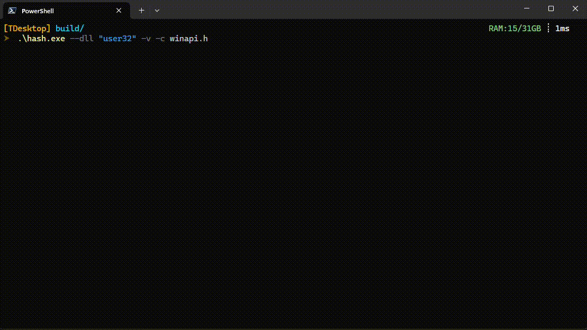

# Windows API Hash Generator

[](https://en.cppreference.com/w/cpp/23)
[](https://www.microsoft.com/en-us/windows)
[](https://www.gnu.org/licenses/agpl-3.0)



Command line utility for generating DJB2 hashes of Windows API functions. Supports API resolution at runtime via hashed values.

## Building

```bash
git clone https://github.com/bitStream93/WinAPI-Hash-Tool.git
cd WinAPI-Hash-Tool
mkdir build && cd build
cmake ..
cmake --build . --config Release
```

Requirements:
- Visual Studio 2022 or later
- CMake 3.20+
- Windows SDK 10.0.19041.0 or later

## Usage

```bash
# Process default system DLLs with verbose output
hash.exe -v

# Process specific DLLs
hash.exe --dll "kernel32,user32"

# Generate C style header
hash.exe -c api_hashes.h

# Hash specific functions
hash.exe --func kernel32:CreateFileA,ReadFile
```

### Command Line Options

| Option | Description |
|--------|-------------|
| `-v` | Enable verbose output |
| `-h <file>` | Generate C++ style header file |
| `-c <file>` | Generate C style header file |
| `--dll "dll1,dll2"` | Process specific DLLs |
| `--func <dll>:<function1,function2,...>` | Hash specific functions from a DLL |
| `--help` | Show help message |

## Output Examples

### C++ Style Header (Struct)
```cpp
struct ApiHash {
    const char* name;
    const char* dll;
    uint32_t hash;
};

constexpr ApiHash API_HASHES[] = {
    {"CreateFileA", "kernel32.dll", 0x7c0017a5},
    {"ReadFile", "kernel32.dll", 0x487a3f56},
};
```

### C Style Header (Defines)
```cpp
#define CreateFileA                    0x7c0017a5
#define ReadFile                       0x487a3f56
```

## License

This project is licensed under the GNU Affero General Public License v3.0 - see the [LICENSE](LICENSE) file for details. This means that if you modify this software and use it to provide a service over a network, you must make the modified source code available to the users of that service.

## Disclaimer

This tool is intended for security research and legitimate software development. The author is not responsible for any misuse or damage caused by this program.
